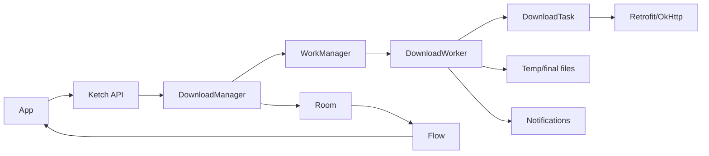

# Ketch

[](https://jitpack.io/#sherafatpour/uturn-android-ketch)
[](https://androidweekly.net/issues/issue-622)

Ketch is a Kotlin Android download manager library built on WorkManager, Room, Retrofit, and Flow. It is designed for app-owned download destinations: the consuming app decides permissions, SAF, MediaStore, and UI; Ketch handles durable background execution, queueing, pause/resume, retry, notifications, and observable state.

<p align="center">
  
</p>

## Features

- Background downloads with `WorkManager`
- Durable state with `Room`
- Observable downloads with Kotlin `Flow`
- Pause, resume, retry, cancel, and clear by id, tag, or all downloads
- Queue management with configurable max concurrent downloads
- Priority scheduling: `LOW`, `NORMAL`, `HIGH`, `IMMEDIATE`
- Per-download constraints: connected, unmetered, not-roaming, charging, battery-not-low, storage-not-low
- Automatic retry with linear or exponential backoff
- HTTP resume support using `Range`
- Best-effort ETag validation before resume
- Signed URL and CDN-friendly defaults: browser-like user agent, identity encoding, unknown content length support
- Temporary `.bt` files while downloading, final extension only after success
- Custom headers and metadata
- Configurable foreground notifications with action buttons
- Custom logger support

## Current Platform

| Item | Version |
| --- | --- |
| Min SDK | 23 |
| Compile SDK | 36 |
| Target SDK sample | 36 |
| Gradle | 9.2.1 |
| Android Gradle Plugin | 9.0.1 |
| WorkManager | 2.11.2 |
| Room | 2.8.4 |
| Retrofit | 3.0.0 |

## Installation

Current release version:

```text
2.1.2
```

Add JitPack:

```groovy
dependencyResolutionManagement {
    repositoriesMode.set(RepositoriesMode.FAIL_ON_PROJECT_REPOS)
    repositories {
        google()
        mavenCentral()
        maven { url 'https://jitpack.io' }
    }
}
```

Add Ketch:

```groovy
dependencies {
    implementation 'com.github.sherafatpour:uturn-android-ketch:2.1.2'
}
```

For Kotlin DSL:

```kotlin
dependencies {
    implementation("com.github.sherafatpour:uturn-android-ketch:2.1.2")
}
```

JitPack builds this repository from the release tag `2.1.2`. If you publish from a fork or a renamed repository, replace the coordinates with:

```text
com.github.<GitHubUserOrOrg>:<RepositoryName>:<Tag>
```

When developing from this repository:

```groovy
dependencies {
    implementation project(':ketch')
}
```

## Release With JitPack

This repository is configured for JitPack through `jitpack.yml` and the `:ketch` `release` Maven publication.

Release coordinates:

```text
com.github.sherafatpour:uturn-android-ketch:2.1.2
```

Release checklist:

```bash
./gradlew :ketch:assembleRelease :ketch:publishReleasePublicationToMavenLocal
./gradlew :ketch:compileDebugKotlin :app:assembleDebug
git tag 2.1.2
git push origin codex/ketch-jitpack-release
git push origin 2.1.2
```

Then open:

```text
https://jitpack.io/#sherafatpour/uturn-android-ketch/2.1.2
```

Wait for JitPack to finish building the tag. The build command used by JitPack is:

```bash
./gradlew :ketch:publishReleasePublicationToMavenLocal -x test
```

The release publication produces:

- `uturn-android-ketch-2.1.2.aar`
- `uturn-android-ketch-2.1.2.pom`
- `uturn-android-ketch-2.1.2-sources.jar`

## Quick Start

Create a singleton instance in your application layer:

```kotlin
class MainApplication : Application() {
    lateinit var ketch: Ketch

    override fun onCreate() {
        super.onCreate()
        ketch = Ketch.builder()
            .setDownloadConfig(
                DownloadConfig(
                    connectTimeOutInMs = 20_000L,
                    readTimeOutInMs = 20_000L,
                    maxConcurrentDownloads = 3
                )
            )
            .enableLogs(BuildConfig.DEBUG)
            .build(this)
    }
}
```

Start a download:

```kotlin
val id = ketch.download(
    url = "https://example.com/video.mp4",
    path = filesDir.absolutePath,
    fileName = "video.mp4"
)
```

Observe it:

```kotlin
viewLifecycleOwner.lifecycleScope.launch {
    repeatOnLifecycle(Lifecycle.State.STARTED) {
        ketch.observeDownloadById(id).collect { download ->
            progressBar.progress = download.progress
        }
    }
}
```

## Advanced Download Options

```kotlin
val id = ketch.download(
    url = url,
    path = destinationDir.absolutePath,
    fileName = "movie.mp4",
    tag = "movies",
    metaData = """{"source":"catalog"}""",
    notificationTitle = "Movie",
    notificationParameter = "1080p",
    headers = hashMapOf("Authorization" to "Bearer $token"),
    priority = DownloadPriority.HIGH,
    constraints = DownloadConstraints(
        networkType = KetchNetworkType.UNMETERED,
        requiresCharging = false,
        requiresBatteryNotLow = true,
        requiresStorageNotLow = false
    ),
    retryPolicy = RetryPolicy(
        maxRetries = 5,
        backoffDelayInMs = 15_000L,
        backoffPolicy = KetchBackoffPolicy.EXPONENTIAL
    )
)
```

## Queue And Priority

Ketch stores every request in Room first. It then schedules pending work according to:

1. `DownloadConfig.maxConcurrentDownloads`
2. `DownloadPriority`
3. `timeQueued`

The default concurrent limit is `3`. If five files are queued and the limit is `3`, only three WorkManager jobs are active at a time. When a slot finishes, Ketch schedules the next highest-priority pending item.

## Controls

```kotlin
ketch.pause(id)
ketch.resume(id)
ketch.retry(id)
ketch.cancel(id)
ketch.clearDb(id)
```

Each command also supports tags or all downloads:

```kotlin
ketch.pause("movies")
ketch.resumeAll()
ketch.cancelAll()
ketch.clearAllDb()
```

## Observability

```kotlin
ketch.observeDownloads(): Flow<List<DownloadModel>>
ketch.observeDownloadById(id): Flow<DownloadModel>
ketch.observeDownloadByTag(tag): Flow<List<DownloadModel>>
ketch.getAllDownloads(): List<DownloadModel>
```

`DownloadModel` includes URL, path, file name, tag, id, headers, status, total bytes, progress, speed, ETag, metadata, failure reason, priority, and retry attempt info.

## Status Lifecycle

```text
QUEUED -> SCHEDULED -> STARTED -> PROGRESS -> SUCCESS
                                      |
                                      +-> PAUSED / CANCELLED / FAILED
```

`QUEUED` means waiting for a local Ketch queue slot. `SCHEDULED` means Ketch has handed the job to WorkManager and it may be waiting for constraints/backoff or worker execution. If a download stays on `SCHEDULED`, check network constraints, WorkManager state, storage permissions, and whether the URL host is reachable.

## Temporary File Behavior

Ketch does not expose a real final extension before the download is complete. If you request:

```kotlin
fileName = "movie.mp4"
```

Ketch writes:

```text
movie.bt
```

After a successful download, it atomically renames the temporary file to:

```text
movie.mp4
```

Cancel and clear operations remove both the final file and the temporary `.bt` file.

## Signed URLs And CDN Links

Ketch supports long query-string URLs such as CDN signed links:

```kotlin
ketch.download(
    url = signedUrl,
    path = downloadDir.absolutePath,
    fileName = "video.mp4",
    headers = hashMapOf(
        "Accept" to "video/mp4,*/*",
        "User-Agent" to "Mozilla/5.0 (Linux; Android 14)"
    )
)
```

For maximum compatibility:

- Always pass an explicit `fileName` for signed URLs.
- Refresh expired signed URLs in the app layer.
- Ketch treats `HEAD`/ETag checks as best effort; if a CDN rejects or times out on `HEAD`, Ketch still attempts the actual `GET`.
- Unknown `Content-Length` is supported, so chunked/CDN responses can still stream to disk.

## Storage Policy

Ketch intentionally does not own SAF, MediaStore UI, or permission flows. The consuming application must decide and prepare the writable destination.

Recommended patterns:

- Use app-specific directories when possible.
- Use SAF in the app layer when the user must pick a document/tree.
- Persist URI permissions in the app layer.
- Convert the app-owned destination to a path only when that is valid for your storage model.

## Notifications

Add notification permission for Android 13+:

```xml
<uses-permission android:name="android.permission.POST_NOTIFICATIONS" />
```

Enable notifications:

```kotlin
ketch = Ketch.builder()
    .setNotificationConfig(
        NotificationConfig(
            enabled = true,
            smallIcon = R.drawable.ic_stat_download
        )
    )
    .build(this)
```

Notification actions support pause, cancel, resume, retry, and terminal status updates.

Ketch checks `POST_NOTIFICATIONS` on Android 13+ and skips notification posting when permission or app notifications are disabled. The consuming app still owns requesting the permission from the user.

Initialize Ketch in `Application.onCreate()` before notification actions are used. Android may deliver notification broadcasts after process recreation, and the singleton should be rebuilt with the same app-level config.

## Content Metadata Helpers

```kotlin
val isSame = ketch.isContentValid(url, eTag = knownETag)
val bytes = ketch.getContentLength(url)
```

These helpers use `HEAD` requests through the same network stack.

## Architecture



## Development

Run the core verification:

```bash
./gradlew :ketch:assembleDebug :ketch:testDebugUnitTest
```

Run the sample app build:

```bash
./gradlew :app:assembleDebug
```

Full check used for this repository:

```bash
./gradlew :ketch:assembleDebug :ketch:testDebugUnitTest :app:assembleDebug --warning-mode all
```

## More Documentation

- [Full Ketch library documentation](docs/KETCH_LIBRARY_DOCUMENTATION.md)
- [Agent guide](AGENTS.md)

## License

```text
Copyright (C) 2024 Khush Panchal

Licensed under the Apache License, Version 2.0 (the "License");
you may not use this file except in compliance with the License.
You may obtain a copy of the License at

    http://www.apache.org/licenses/LICENSE-2.0
```
