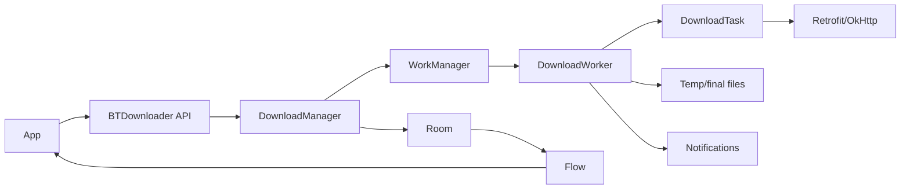

# BTDownloader

[](https://jitpack.io/#sherafatpour/BTDownloader)
[](https://androidweekly.net/issues/issue-622)

BTDownloader is a Kotlin Android download manager library built on WorkManager, Room, Retrofit, and Flow. It is designed for app-owned download destinations: the consuming app decides permissions, SAF, MediaStore, and UI; BTDownloader handles durable background execution, queueing, pause/resume, retry, notifications, and observable state.

## Features

- Background downloads with `WorkManager`
- Durable state with `Room`
- Observable downloads with Kotlin `Flow`
- Pause, resume, retry, cancel, and clear by id, tag, or all downloads
- Queue management with configurable max concurrent downloads
- Priority scheduling: `LOW`, `NORMAL`, `HIGH`, `IMMEDIATE`
- Runtime priority updates for queued/future work
- Per-download constraints: connected, unmetered, not-roaming, charging, battery-not-low, storage-not-low
- Scheduled downloads at a specific epoch time with WorkManager-backed persistence
- Automatic retry with linear or exponential backoff
- Optional speed throttling and free-space preflight
- Optional checksum verification with `MD5` or `SHA256`
- Optional auto rename when the requested file name already exists
- HTTP resume support using `Range`
- Best-effort ETag validation before resume
- Signed URL and CDN-friendly defaults: browser-like user agent, identity encoding, unknown content length support
- Temporary `.bt` files while downloading, final extension only after success
- Custom headers and metadata
- Configurable foreground notifications with action buttons
- Custom logger support

## Current Platform

| Item | Version |
| --- | --- |
| Min SDK | 23 |
| Compile SDK | 36 |
| Target SDK sample | 36 |
| Gradle | 9.2.1 |
| Android Gradle Plugin | 9.0.0 |
| WorkManager | 2.11.2 |
| Room | 2.8.4 |
| Retrofit | 3.0.0 |

## Installation

Current release version:

```text
1.1.0
```

Add JitPack:

```groovy
dependencyResolutionManagement {
    repositoriesMode.set(RepositoriesMode.FAIL_ON_PROJECT_REPOS)
    repositories {
        google()
        mavenCentral()
        maven { url 'https://jitpack.io' }
    }
}
```

Add BTDownloader:

```groovy
dependencies {
    implementation 'com.github.sherafatpour:BTDownloader:1.1.0'
}
```

For Kotlin DSL:

```kotlin
dependencies {
    implementation("com.github.sherafatpour:BTDownloader:1.1.0")
}
```

JitPack builds this repository from the release tag `1.1.0`. If you publish from a fork or a renamed repository, replace the coordinates with:

```text
com.github.<GitHubUserOrOrg>:<RepositoryName>:<Tag>
```

When developing from this repository:

```groovy
dependencies {
    implementation project(':ketch')
}
```

## Release With JitPack

This repository is configured for JitPack through `jitpack.yml` and the `:ketch` `release` Maven publication.

`BTDownloader` is the preferred entry point. The public package is `com.sherafatpour.bluetile`, and `BTDownloader` is the main entry point.

Release coordinates:

```text
com.github.sherafatpour:BTDownloader:1.1.0
```

Release checklist:

```bash
./gradlew :ketch:assembleRelease :ketch:publishReleasePublicationToMavenLocal
./gradlew :ketch:compileDebugKotlin :app:assembleDebug
git tag 1.1.0
git push origin codex/ketch-jitpack-release
git push origin 1.1.0
```

Then open:

```text
https://jitpack.io/#sherafatpour/BTDownloader/1.1.0
```

Wait for JitPack to finish building the tag. The build command used by JitPack is:

```bash
./gradlew :ketch:publishReleasePublicationToMavenLocal -x test
```

The release publication produces:

- `BTDownloader-1.1.0.aar`
- `BTDownloader-1.1.0.pom`
- `BTDownloader-1.1.0-sources.jar`

## Quick Start

Create a singleton instance in your application layer:

```kotlin
class MainApplication : Application() {
    lateinit var btDownload: BTDownloader

    override fun onCreate() {
        super.onCreate()
        btDownload = BTDownloader.builder()
            .setDownloadConfig(
                DownloadConfig(
                    connectTimeOutInMs = 20_000L,
                    readTimeOutInMs = 20_000L,
                    maxConcurrentDownloads = 3,
                    speedLimitBytesPerSecond = 0L,
                    freeSpaceBufferBytes = 10L * 1024L * 1024L
                )
            )
            .enableLogs(BuildConfig.DEBUG)
            .build(this)
    }
}
```

Start a download:

```kotlin
val id = btDownload.download(
    url = "https://example.com/video.mp4",
    path = filesDir.absolutePath,
    fileName = "video.mp4"
)
```

If `fileName` is omitted, BTDownloader derives the file name from the URL path:

```kotlin
val id = btDownload.download(
    url = "https://example.com/files/video.mp4",
    path = filesDir.absolutePath
)
```

Observe it:

```kotlin
viewLifecycleOwner.lifecycleScope.launch {
    repeatOnLifecycle(Lifecycle.State.STARTED) {
        btDownload.observeDownloadById(id).collect { download ->
            progressBar.progress = download.progress
        }
    }
}
```

## Advanced Download Options

```kotlin
val id = btDownload.download(
    url = url,
    path = destinationDir.absolutePath,
    fileName = "movie.mp4",
    tag = "movies",
    metaData = """{"source":"catalog"}""",
    notificationTitle = "Movie",
    notificationParameter = "1080p",
    headers = hashMapOf("Authorization" to "Bearer $token"),
    priority = DownloadPriority.HIGH,
    constraints = DownloadConstraints(
        networkType = BTDownloaderNetworkType.UNMETERED,
        requiresCharging = false,
        requiresBatteryNotLow = true,
        requiresStorageNotLow = false
    ),
    retryPolicy = RetryPolicy(
        maxRetries = 5,
        backoffDelayInMs = 15_000L,
        backoffPolicy = BTDownloaderBackoffPolicy.EXPONENTIAL
    ),
    checksum = DownloadChecksum(
        algorithm = DownloadChecksumAlgorithm.SHA256,
        value = "expected-sha256-hex"
    ),
    autoRenameIfExists = true
)
```

## Scheduled Downloads

Use `schedule(...)` when a download should start at or after a specific time. The request is persisted in Room and handed to WorkManager with an initial delay, so it can still run after the app process is closed. Android may delay execution slightly depending on battery, standby, constraints, and system scheduling.

```kotlin
val id = btDownload.schedule(
    url = "https://example.com/report.pdf",
    path = filesDir.absolutePath,
    scheduledAtEpochMs = System.currentTimeMillis() + 30 * 60_000L,
    priority = DownloadPriority.NORMAL,
    constraints = DownloadConstraints(
        networkType = BTDownloaderNetworkType.UNMETERED,
        requiresCharging = true
    )
)
```

Use `startNow(id)` to manually start a scheduled or queued item immediately.

## Queue And Priority

BTDownloader stores every request in Room first. It then schedules pending work according to:

1. `DownloadConfig.maxConcurrentDownloads`
2. `DownloadPriority`
3. `timeQueued`

The default concurrent limit is `3`. If five files are queued and the limit is `3`, only three WorkManager jobs are active at a time. When a slot finishes, BTDownloader schedules the next highest-priority pending item.

Queued priority can be updated later:

```kotlin
btDownload.setPriority(id, DownloadPriority.HIGH)
```

## Controls

```kotlin
btDownload.pause(id)
btDownload.resume(id)
btDownload.retry(id)
btDownload.cancel(id)
btDownload.clearDb(id)
btDownload.startNow(id)
```

Each command also supports tags or all downloads:

```kotlin
btDownload.pause("movies")
btDownload.resumeAll()
btDownload.cancelAll()
btDownload.clearAllDb()
btDownload.cleanupIncompleteDownloads()
```

`startNow(id)` is a manual-start path: if all slots are full, BTDownloader pauses one lower-priority active download, starts this one first, then resumes the preempted download after this manual-started item reaches a terminal state.

## Observability

```kotlin
btDownload.observeDownloads(): Flow<List<DownloadModel>>
btDownload.observeDownloadById(id): Flow<DownloadModel>
btDownload.observeDownloadByTag(tag): Flow<List<DownloadModel>>
btDownload.getAllDownloads(): List<DownloadModel>
```

`DownloadModel` includes URL, path, file name, tag, id, headers, status, total bytes, progress, speed, ETag, metadata, failure reason, priority, scheduled time, and retry attempt info.

## Sample App

The `:app` module is a Jetpack Compose sample that uses an MVI-style `DownloadManagerViewModel`. It demonstrates immediate downloads, scheduled downloads with date/time picking, priority selection, network constraints, charging constraints, pause/resume/retry/cancel/delete/open actions, and `startNow(id)` from the overflow menu.

## Status Lifecycle

```text
QUEUED -> SCHEDULED -> STARTED -> PROGRESS -> SUCCESS
                                      |
                                      +-> PAUSED / CANCELLED / FAILED
```

`QUEUED` means waiting for a local BTDownloader queue slot. `SCHEDULED` means BTDownloader has handed the job to WorkManager and it may be waiting for constraints/backoff or worker execution. If a download stays on `SCHEDULED`, check network constraints, WorkManager state, storage permissions, and whether the URL host is reachable.

## Temporary File Behavior

BTDownloader does not expose a real final extension before the download is complete. If you request:

```kotlin
fileName = "movie.mp4"
```

BTDownloader writes:

```text
movie.bt
```

After a successful download, it atomically renames the temporary file to:

```text
movie.mp4
```

Cancel and clear operations remove both the final file and the temporary `.bt` file.

## Signed URLs And CDN Links

BTDownloader supports long query-string URLs such as CDN signed links:

```kotlin
btDownload.download(
    url = signedUrl,
    path = downloadDir.absolutePath,
    fileName = "video.mp4",
    headers = hashMapOf(
        "Accept" to "video/mp4,*/*",
        "User-Agent" to "Mozilla/5.0 (Linux; Android 14)"
    )
)
```

For maximum compatibility:

- Always pass an explicit `fileName` for signed URLs.
- Refresh expired signed URLs in the app layer.
- BTDownloader treats `HEAD`/ETag checks as best effort; if a CDN rejects or times out on `HEAD`, BTDownloader still attempts the actual `GET`.
- Unknown `Content-Length` is supported, so chunked/CDN responses can still stream to disk.

## Storage Policy

BTDownloader intentionally does not own SAF, MediaStore UI, or permission flows. The consuming application must decide and prepare the writable destination.

Recommended patterns:

- Use app-specific directories when possible.
- Use SAF in the app layer when the user must pick a document/tree.
- Persist URI permissions in the app layer.
- Convert the app-owned destination to a path only when that is valid for your storage model.

## Notifications

Add notification permission for Android 13+:

```xml
<uses-permission android:name="android.permission.POST_NOTIFICATIONS" />
```

Enable notifications:

```kotlin
class App : Application() {
    lateinit var downloader: BTDownloader

    override fun onCreate() {
        super.onCreate()

        downloader = BTDownloader.builder()
            .setNotificationConfig(
                NotificationConfig(
                    enabled = true,
                    smallIcon = R.drawable.ic_stat_download
                )
            )
            .build(this)
    }
}
```

Notification actions support pause, cancel, resume, retry, and terminal status updates.

BTDownloader checks `POST_NOTIFICATIONS` on Android 13+ and skips notification posting when permission or app notifications are disabled. The consuming app still owns requesting the permission from the user.

Use a real monochrome status-bar drawable for `smallIcon`; do not pass an adaptive launcher icon or launcher foreground asset. If a notification is skipped or Android rejects the foreground notification, BTDownloader writes the reason to logcat with the `BTDownloaderNotification` tag while the download continues.

Initialize BTDownloader in `Application.onCreate()` before notification actions are used. Android may deliver notification broadcasts after process recreation, and the singleton should be rebuilt with the same app-level config.

If notifications do not appear in the consuming app, check these first:

- `NotificationConfig.enabled` is `true`.
- `smallIcon` is a valid notification drawable, not a launcher/adaptive icon.
- Android 13+ runtime permission `POST_NOTIFICATIONS` has been granted.
- App notifications are enabled in system settings.
- BTDownloader is initialized in `Application.onCreate()`, not only in an Activity or Fragment.
- Logcat does not show a warning under the `BTDownloaderNotification` tag.

For Android 13+ runtime permission, the app can request it with the normal Android permission flow:

```kotlin
if (Build.VERSION.SDK_INT >= Build.VERSION_CODES.TIRAMISU &&
    checkSelfPermission(Manifest.permission.POST_NOTIFICATIONS) != PackageManager.PERMISSION_GRANTED
) {
    requestPermissions(arrayOf(Manifest.permission.POST_NOTIFICATIONS), 101)
}
```

## Content Metadata Helpers

```kotlin
val isSame = btDownload.isContentValid(url, eTag = knownETag)
val bytes = btDownload.getContentLength(url)
```

These helpers use `HEAD` requests through the same network stack.

## Architecture



## Development

Run the core verification:

```bash
./gradlew :ketch:assembleDebug :ketch:testDebugUnitTest
```

Run the sample app build:

```bash
./gradlew :app:assembleDebug
```

Full check used for this repository:

```bash
./gradlew :ketch:assembleDebug :ketch:testDebugUnitTest :app:assembleDebug --warning-mode all
```

## More Documentation

- [Full BTDownloader library documentation](docs/BTDownloader.md)
- [Changelog](CHANGELOG.md)
- [Agent guide](AGENTS.md)

## License

```text
Copyright (C) 2024 Khush Panchal

Licensed under the Apache License, Version 2.0 (the "License");
you may not use this file except in compliance with the License.
You may obtain a copy of the License at

    http://www.apache.org/licenses/LICENSE-2.0
```
