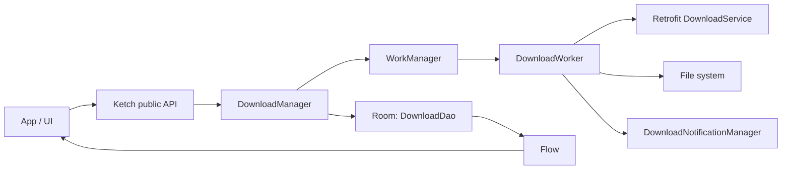

# مستند کتابخانه Ketch

این سند وضعیت فعلی ماژول `ketch` را بعد از بروزرسانی ابزارها و dependencyها توضیح می‌دهد. Ketch یک کتابخانه دانلود فایل برای Android است که دانلودها را با `WorkManager` اجرا می‌کند، وضعیت را در `Room` نگه می‌دارد، شبکه را با `Retrofit/OkHttp` انجام می‌دهد و نتیجه را با `Flow` در اختیار برنامه قرار می‌دهد.

## وضعیت بروزرسانی

پروژه به toolchain جدید Android مهاجرت داده شده است:

| بخش | نسخه فعلی |
| --- | --- |
| Gradle wrapper | `9.4.1` |
| Android Gradle Plugin | `9.2.1` |
| Kotlin Android support | built-in در AGP 9 |
| KSP | `2.3.6` |
| Compile SDK | `36` |
| Target SDK sample app | `36` |
| Min SDK | `23` |
| WorkManager | `2.11.2` |
| Room | `2.8.4` |
| Retrofit | `3.0.0` |
| Gson | `2.14.0` |
| AndroidX Core | `1.17.0` |

نکات migration:

- در AGP 9 دیگر نیازی به اعمال مستقیم پلاگین `org.jetbrains.kotlin.android` در ماژول‌های Android نیست.
- DSL قدیمی `kotlinOptions` از build scriptها حذف شد.
- API جدید OkHttp/Retrofit برای `response.raw().request.url` استفاده شد.
- `fallbackToDestructiveMigration(dropAllTables = true)` جایگزین overload قدیمی Room شد.
- مسیر cancellation در `DownloadWorker` دیگر با `GlobalScope` اجرا نمی‌شود و با `withContext(NonCancellable)` وضعیت نهایی دانلود را ثبت می‌کند.

## نصب

اگر از JitPack استفاده می‌کنید:

```groovy
dependencyResolutionManagement {
    repositoriesMode.set(RepositoriesMode.FAIL_ON_PROJECT_REPOS)
    repositories {
        google()
        mavenCentral()
        maven { url 'https://jitpack.io' }
    }
}
```

```groovy
dependencies {
    implementation 'com.github.sherafatpour:uturn-android-ketch:2.1.3'
}
```

برای Kotlin DSL:

```kotlin
dependencies {
    implementation("com.github.sherafatpour:uturn-android-ketch:2.1.3")
}
```

این مختصات برای release tag `2.1.3` در repository فعلی است. اگر کتابخانه را از fork یا repository دیگری منتشر می‌کنید، الگو این است:

```text
com.github.<GitHubUserOrOrg>:<RepositoryName>:<Tag>
```

اگر کتابخانه را از همین repository مصرف می‌کنید:

```groovy
dependencies {
    implementation project(':ketch')
}
```

## انتشار نسخه JitPack

نسخه ریلیز فعلی:

```text
2.1.3
```

ماژول `:ketch` با `maven-publish` پیکربندی شده و `jitpack.yml` در ریشه پروژه این فرمان را برای JitPack اجرا می‌کند:

```bash
./gradlew :ketch:publishReleasePublicationToMavenLocal -x test
```

قبل از tag زدن نسخه:

```bash
./gradlew :ketch:assembleRelease :ketch:publishReleasePublicationToMavenLocal
./gradlew :ketch:compileDebugKotlin :app:assembleDebug
```

سپس tag و push:

```bash
git tag 2.1.3
git push origin codex/ketch-jitpack-release
git push origin 2.1.3
```

لینک build در JitPack:

```text
https://jitpack.io/#sherafatpour/uturn-android-ketch/2.1.3
```

خروجی publication شامل `AAR`، `POM` و `sources.jar` است.

## راه‌اندازی سریع

در `Application` یا جایی با طول عمر مناسب، یک instance بسازید. `Ketch` singleton است و context را به `applicationContext` تبدیل می‌کند.

```kotlin
class MainApplication : Application() {
    lateinit var ketch: Ketch

    override fun onCreate() {
        super.onCreate()
        ketch = Ketch.builder()
            .setDownloadConfig(
                DownloadConfig(
                    connectTimeOutInMs = 20_000L,
                    readTimeOutInMs = 20_000L,
                    maxConcurrentDownloads = 3
                )
            )
            .enableLogs(BuildConfig.DEBUG)
            .build(this)
    }
}
```

شروع دانلود:

```kotlin
val id = ketch.download(
    url = url,
    path = downloadDirectory.absolutePath,
    fileName = "video.mp4",
    tag = "videos",
    headers = hashMapOf("Authorization" to "Bearer token"),
    priority = DownloadPriority.HIGH,
    constraints = DownloadConstraints(
        networkType = KetchNetworkType.UNMETERED,
        requiresBatteryNotLow = true
    ),
    retryPolicy = RetryPolicy(
        maxRetries = 5,
        backoffDelayInMs = 15_000L,
        backoffPolicy = KetchBackoffPolicy.EXPONENTIAL
    )
)
```

مشاهده وضعیت:

```kotlin
viewLifecycleOwner.lifecycleScope.launch {
    repeatOnLifecycle(Lifecycle.State.STARTED) {
        ketch.observeDownloadById(id).collect { model ->
            render(model.status, model.progress, model.speedInBytePerMs)
        }
    }
}
```

## مجوزها و storage

خود کتابخانه مسیر ذخیره‌سازی را از caller می‌گیرد، پس برنامه باید قبل از دانلود مطمئن شود که به مسیر انتخاب‌شده دسترسی دارد.

- برای مسیرهای app-specific معمولا نیاز به permission جداگانه نیست.
- اگر برنامه به Storage Access Framework نیاز دارد، انتخاب document/tree، گرفتن permission، persist کردن URI permission و تبدیل آن به مقصد قابل نوشتن باید در خود اپلیکیشن مصرف‌کننده انجام شود. Ketch عمدا UI یا permission flow مربوط به SAF را مدیریت نمی‌کند تا در پروژه‌های مختلف قابل استفاده بماند.
- برای notification در Android 13 به بعد، permission زیر را در manifest بگذارید و runtime request انجام دهید:

```xml
<uses-permission android:name="android.permission.POST_NOTIFICATIONS" />
```

## تنظیمات

### DownloadConfig

```kotlin
data class DownloadConfig(
    val connectTimeOutInMs: Long = 30_000L,
    val readTimeOutInMs: Long = 30_000L,
    val maxConcurrentDownloads: Int = 3
)
```

این تنظیمات هنگام ساخت `Retrofit` و `OkHttpClient` و همچنین کنترل سقف دانلودهای همزمان استفاده می‌شود.

### DownloadConstraints

```kotlin
DownloadConstraints(
    networkType = KetchNetworkType.CONNECTED,
    requiresCharging = false,
    requiresBatteryNotLow = false,
    requiresStorageNotLow = false
)
```

این مدل به `WorkManager Constraints` تبدیل می‌شود. `networkType` یکی از `ANY`, `CONNECTED`, `UNMETERED`, `NOT_ROAMING` است.

### RetryPolicy

```kotlin
RetryPolicy(
    maxRetries = 3,
    backoffDelayInMs = 10_000L,
    backoffPolicy = KetchBackoffPolicy.EXPONENTIAL
)
```

در خطاهای غیر از cancel/pause، تا زمانی که `runAttemptCount < maxRetries` باشد، worker با `Result.retry()` به WorkManager برمی‌گردد و WorkManager طبق backoff دوباره اجرا می‌کند.

### NotificationConfig

```kotlin
NotificationConfig(
    enabled = true,
    channelName = "File Download",
    channelDescription = "Notify file download status",
    importance = NotificationManager.IMPORTANCE_HIGH,
    showSpeed = true,
    showSize = true,
    showTime = true,
    smallIcon = R.drawable.ic_stat_download
)
```

اگر `enabled = true` باشد، `smallIcon` باید یک drawable معتبر، تک‌رنگ و مناسب status bar باشد. از adaptive launcher icon یا launcher foreground برای notification استفاده نکنید. notificationها برای progress، pause، cancel، failed و success ساخته می‌شوند.

Ketch قبل از ارسال notification، permission `POST_NOTIFICATIONS` در Android 13+ و فعال بودن notificationهای اپ را بررسی می‌کند. درخواست permission همچنان مسئولیت اپلیکیشن مصرف‌کننده است. برای اینکه actionهای notification بعد از process recreation هم config درست داشته باشند، Ketch را در `Application.onCreate()` با config اصلی برنامه initialize کنید.

اگر notification نمایش داده نشود، logcat را با tag `KetchNotification` بررسی کنید. کتابخانه در صورت نبود permission، خاموش بودن notificationهای اپ، تنظیم نشدن `smallIcon`، یا رد شدن foreground notification توسط Android دلیل را log می‌کند و خود دانلود را متوقف نمی‌کند.

### Logger

برای اتصال logهای کتابخانه به سیستم logging برنامه:

```kotlin
class AppLogger : Logger {
    override fun log(tag: String?, msg: String?, tr: Throwable?, type: LogType) {
        // Timber، Crashlytics یا logger داخلی برنامه
    }
}

val ketch = Ketch.builder()
    .setLogger(AppLogger())
    .build(context)
```

## API عمومی

### download

```kotlin
fun download(
    url: String,
    path: String,
    fileName: String = FileUtil.getFileNameFromUrl(url),
    tag: String = "",
    metaData: String = "",
    notificationTitle: String = "",
    notificationParameter: String = "",
    headers: HashMap<String, String> = hashMapOf(),
    priority: DownloadPriority = DownloadPriority.NORMAL,
    constraints: DownloadConstraints = DownloadConstraints(),
    retryPolicy: RetryPolicy = RetryPolicy()
): Int
```

یک `DownloadRequest` داخلی می‌سازد و آن را در پایگاه داده ثبت می‌کند. Ketch فقط وقتی slot آزاد داشته باشد آن را وارد WorkManager می‌کند. مقدار برگشتی `id` دانلود است. این `id` از ترکیب `url`، `path` و `fileName` ساخته می‌شود.

### صف، priority و concurrency

هر دانلود ابتدا در Room با وضعیت `QUEUED` ثبت می‌شود. سپس `DownloadManager` بر اساس سه معیار آن را schedule می‌کند:

1. سقف `DownloadConfig.maxConcurrentDownloads`
2. مقدار `DownloadPriority`
3. زمان ثبت `timeQueued`

اگر سقف همزمانی `3` باشد و پنج دانلود ثبت شود، فقط سه job وارد WorkManager می‌شوند. با تمام شدن، fail شدن یا cancel شدن هر job، Ketch slot بعدی را از صف فعال می‌کند.

### کنترل دانلودها

| عملیات | با id | با tag | همه |
| --- | --- | --- | --- |
| Pause | `pause(id)` | `pause(tag)` | `pauseAll()` |
| Resume | `resume(id)` | `resume(tag)` | `resumeAll()` |
| Retry | `retry(id)` | `retry(tag)` | `retryAll()` |
| Cancel | `cancel(id)` | `cancel(tag)` | `cancelAll()` |
| Delete db/file | `clearDb(id)` | `clearDb(tag)` | `clearAllDb()` |

`clearDb(timeInMillis)` همه رکوردها و فایل‌هایی را پاک می‌کند که `lastModified` آنها برابر یا قدیمی‌تر از timestamp داده‌شده است.

### مشاهده دانلودها

```kotlin
fun observeDownloads(): Flow<List<DownloadModel>>
fun observeDownloadById(id: Int): Flow<DownloadModel>
fun observeDownloadByTag(tag: String): Flow<List<DownloadModel>>
suspend fun getAllDownloads(): List<DownloadModel>
```

`Flow`ها مستقیما از Room می‌آیند و با تغییر وضعیت دانلود، مقدار جدید emit می‌کنند.

### بررسی metadata فایل remote

```kotlin
suspend fun isContentValid(
    url: String,
    headers: HashMap<String, String> = hashMapOf(),
    eTag: String
): Boolean

suspend fun getContentLength(
    url: String,
    headers: HashMap<String, String> = hashMapOf()
): Long
```

این دو API با request نوع `HEAD` مقدار `ETag` یا `Content-Length` را از سرور می‌خوانند.

## DownloadModel

`DownloadModel` مدل public برای UI و business layer است:

| فیلد | توضیح |
| --- | --- |
| `id` | شناسه یکتا برای کنترل دانلود |
| `url`, `path`, `fileName` | مشخصات فایل |
| `notificationTitle`, `notificationParameter` | داده‌های نمایش notification |
| `tag` | گروه‌بندی دانلودها |
| `headers` | headerهای شبکه |
| `timeQueued` | زمان ثبت اولیه |
| `status` | وضعیت فعلی |
| `total` | اندازه کل فایل بر حسب byte |
| `progress` | درصد پیشرفت 0 تا 100 |
| `speedInBytePerMs` | سرعت بر حسب byte/ms |
| `lastModified` | آخرین زمان تغییر رکورد |
| `eTag` | ETag دریافتی از response |
| `metaData` | داده آزاد برنامه |
| `failureReason` | پیام خطا در وضعیت failed |
| `priority` | اولویت زمان‌بندی دانلود |
| `runAttemptCount` | تعداد تلاش‌های WorkManager برای job فعلی |
| `maxRetries` | سقف retry خودکار |

## وضعیت‌ها

```text
QUEUED -> SCHEDULED -> STARTED -> PROGRESS -> SUCCESS
                                      |         |
                                      |         + terminal
                                      +-> PAUSED / CANCELLED / FAILED
```

- `QUEUED`: رکورد ساخته شده و در صف داخلی Ketch منتظر slot آزاد است.
- `SCHEDULED`: دانلود به WorkManager تحویل شده و ممکن است منتظر constraints/backoff یا شروع اجرای worker باشد. اگر طولانی در این وضعیت ماند، constraints، وضعیت WorkManager، permission مسیر ذخیره‌سازی و reachable بودن host را بررسی کنید.
- `STARTED`: worker شروع شده و اندازه فایل مشخص شده است.
- `PROGRESS`: دانلود در جریان است.
- `PAUSED`: کاربر pause کرده و فایل موقت برای resume باقی می‌ماند.
- `CANCELLED`: کاربر cancel کرده و فایل موقت پاک می‌شود.
- `FAILED`: خطای شبکه، file system یا response رخ داده است.
- `SUCCESS`: فایل کامل شده و فایل موقت به نام نهایی rename شده است.

## معماری داخلی



### اجزای اصلی

- `Ketch`: facade عمومی کتابخانه و نقطه ورود برنامه.
- `DownloadManager`: ثبت رکوردها، enqueue/cancel WorkManager، و اجرای عملیات pause/resume/retry/clear.
- `DownloadWorker`: اجرای واقعی دانلود در background، به‌روزرسانی database، progress، notification و نتیجه نهایی.
- `DownloadTask`: خواندن stream از شبکه، نوشتن فایل موقت و محاسبه progress/speed.
- `DownloadDao` و `DownloadDatabase`: persistence دانلودها با Room.
- `RetrofitInstance` و `DownloadService`: ساخت client و اجرای `GET`/`HEAD`.
- `DownloadNotificationManager` و `NotificationReceiver`: نمایش و مدیریت actionهای notification.
- `FileUtil`, `WorkUtil`, `MapperUtil`, `TextUtil`: utilityهای فایل، serialization، mapping و متن notification.

## رفتار resume، فایل موقت و ETag

Ketch برای resume از header زیر استفاده می‌کند:

```text
Range: bytes=<current-file-length>-
```

فایل در زمان دانلود با پسوند موقت `.bt` ذخیره می‌شود تا قبل از کامل شدن، فایل با پسوند واقعی در مسیر مقصد دیده نشود. مثلا `movie.mp4` هنگام دانلود به شکل `movie.bt` نوشته می‌شود و فقط بعد از موفقیت به همان `fileName` درخواستی caller یعنی `movie.mp4` rename می‌شود. اگر سرور response نامعتبر بدهد، range را قبول نکند، redirect رخ دهد، یا ETag جدید با ETag قبلی متفاوت باشد، فایل موقت پاک می‌شود و دانلود از ابتدا شروع می‌شود.

برای لینک‌های CDN و signed URL:

- `HEAD` و ETag validation حالت best-effort دارد. اگر سرور `HEAD` را timeout یا reject کند، دانلود اصلی با `GET` ادامه پیدا می‌کند.
- اگر `Content-Length` نامعلوم باشد، stream همچنان روی دیسک نوشته می‌شود و طول نهایی بعد از اتمام از تعداد byteهای نوشته‌شده محاسبه می‌شود.
- headerهای پیش‌فرض `Accept: */*`, `Accept-Encoding: identity` و یک `User-Agent` سازگار اضافه می‌شوند، مگر اینکه caller مقدار خودش را بدهد.
- برای URLهایی که query امضا شده دارند، caller باید `fileName` صریح بدهد و در صورت expire شدن لینک، URL جدید بسازد.

## Notification actions

وقتی notification فعال باشد:

- در progress، کاربر می‌تواند pause یا cancel کند.
- در failed، action برای retry نمایش داده می‌شود.
- در paused، action برای resume نمایش داده می‌شود.
- در terminal stateها، notification قبلی dismiss یا با notification نهایی جایگزین می‌شود.

## نکات نگهداری

- اگر schema دیتابیس تغییر کند، نسخه `DownloadDatabase` را بالا ببرید و migration واقعی اضافه کنید. وضعیت فعلی از destructive migration استفاده می‌کند.
- برای انتشار کتابخانه، بهتر است sample app هم با `./gradlew :app:assembleDebug` تست شود.
- برای تست رفتار واقعی pause/resume، فقط unit test کافی نیست؛ یک instrumentation یا تست دستی با فایل بزرگ و سرور دارای `Range` لازم است.
- چون `id` از `url + path + fileName` ساخته می‌شود، enqueue کردن همان فایل در همان مسیر همان شناسه را تولید می‌کند.
- API عمومی فعلا `HashMap<String, String>` برای headerها می‌گیرد؛ اگر در آینده API شکسته مجاز باشد، `Map<String, String>` انعطاف‌پذیرتر است.

## فرمان‌های بررسی

```bash
./gradlew :ketch:assembleDebug :ketch:testDebugUnitTest
./gradlew :app:assembleDebug
```
